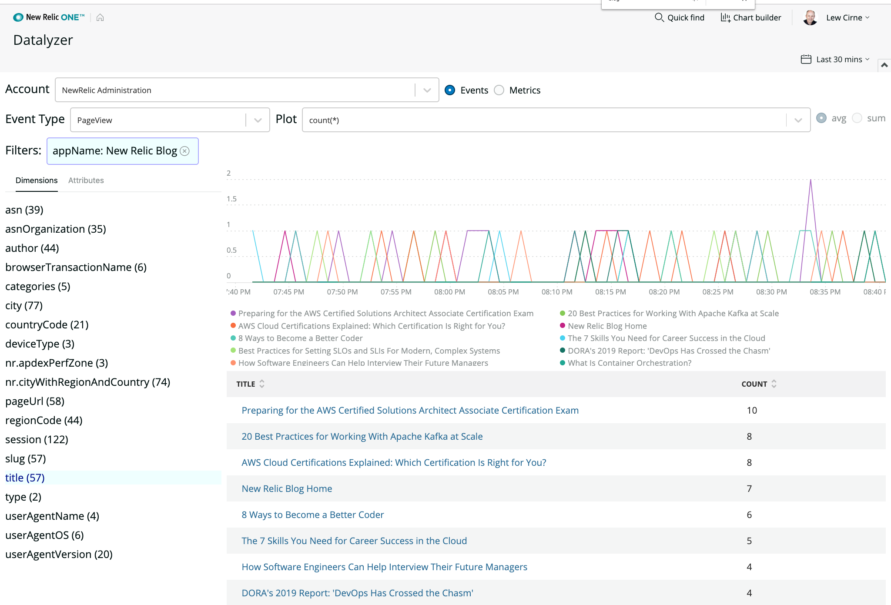

# Datalyzer

 [](https://snyk.io/test/github/newrelic/nr1-datalyzer)

## Usage

Datalyzer provides a simple, curated way to explore your data within New Relic.

Users can create basic charts and queries, which can be run inside the Chart Builder. From the Chart Builder, you can change the chart type, change the query and add the chart to a dashboard.

Datalyzer can be accessed both globally, and in the context of a Service, Mobile or Browser application.



Using Datalyzer from a Service, Mobile or Browser application limits the events, metrics, attributes and dimensions to data reported by those entities.


## Open Source License

This project is distributed under the [Apache 2 license](blob/master/LICENSE).

## Dependencies

Requires data in NRDB from any or all of the New Relic products.

> **Note**: When you select _Metrics_ (as opposed to _Events_), Datalyzer
> allows you to explore dimensional metric data that was introduced by New Relic
> in September, 2019, and is supported by products such as the New Relic
> [Prometheus OpenMetrics integration](https://docs.newrelic.com/docs/new-relic-prometheus-openmetrics-integration-kubernetes) and the [Metric API](https://docs.newrelic.com/docs/introduction-new-relic-metric-api).
> Traditional (nondimensional) metrics collected by older New Relic products are not currently supported.

## Getting started

First, ensure that you have [Git](https://git-scm.com/book/en/v2/Getting-Started-Installing-Git) and [NPM](https://www.npmjs.com/get-npm) installed. If you're unsure whether you have one or both of them installed, run the following command(s) (If you have them installed these commands will return a version number, if not, the commands won't be recognized):

```bash
git --version
npm -v
```

Next, clone this repository and run the following scripts:

```bash
nr1 nerdpack:clone -r https://github.com/newrelic/nr1-datalyzer.git
cd nr1-datalyzer
nr1 nerdpack:uuid -gf
npm install
npm start
```

Visit [https://one.newrelic.com/?nerdpacks=local](https://one.newrelic.com/?nerdpacks=local), navigate to the Nerdpack, and :sparkles:

## Deploying this Nerdpack

Open a command prompt in the nerdpack's directory and run the following commands.

```bash
# this is to create a new uuid for the nerdpack so that you can deploy it to your account
nr1 nerdpack:uuid -gf [--profile=your_profile_name]
# to see a list of APIkeys / profiles available in your development environment, run nr1 credentials:list
nr1 nerdpack:publish [--profile=your_profile_name]
nr1 nerdpack:deploy [-c [DEV|BETA|STABLE]] [--profile=your_profile_name]
nr1 nerdpack:subscribe [-c [DEV|BETA|STABLE]] [--profile=your_profile_name]
```

Visit [https://one.newrelic.com](https://one.newrelic.com), navigate to the Nerdpack, and :sparkles:

## Community Support

New Relic hosts and moderates an online forum where you can interact with New Relic employees as well as other customers to get help and share best practices. Like all New Relic open source community projects, there's a related topic in the New Relic Explorers Hub. You can find this project's topic/threads here:

[https://discuss.newrelic.com/t/the-datalyzer-nerdpack/82720](https://discuss.newrelic.com/t/the-datalyzer-nerdpack/82720)
_(Note: URL subject to change before GA)_

Please do not report issues with Datalyzer to New Relic Global Technical Support. Instead, visit the [`Explorers Hub`](https://discuss.newrelic.com/c/build-on-new-relic) for troubleshooting and best-practices.

## Issues / Enhancement Requests

Issues and enhancement requests can be submitted in the [Issues tab of this repository](../../issues). Please search for and review the existing open issues before submitting a new issue.

## Contributing

Contributions are welcome (and if you submit a Enhancement Request, expect to be invited to contribute it yourself :grin:). Please review our [Contributors Guide](CONTRIBUTING.md).

Keep in mind that when you submit your pull request, you'll need to sign the CLA via the click-through using CLA-Assistant. If you'd like to execute our corporate CLA, or if you have any questions, please drop us an email at opensource@newrelic.com.
